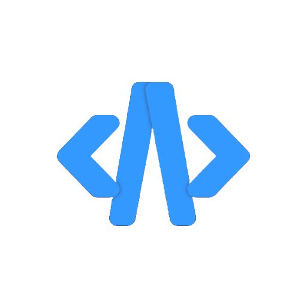
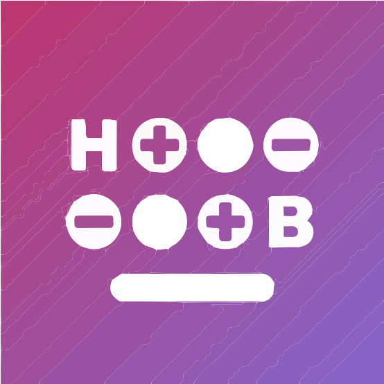
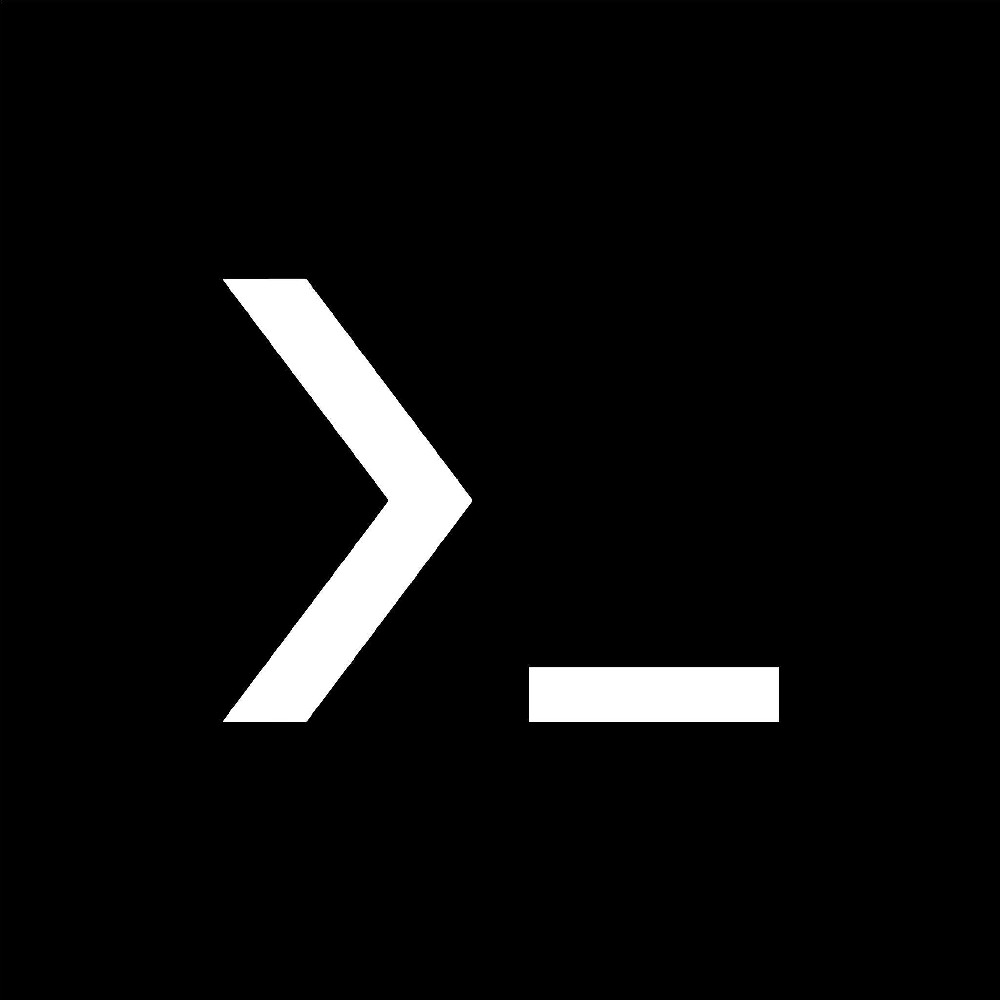
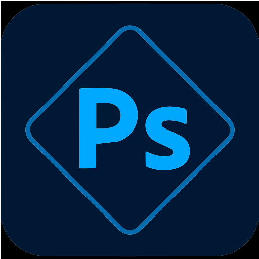

<h1>Nadson de Jesus Almeida</h1>
Sou atualmente um estudante que programa através do celular que sempre busca melhorar.

<h2>ℹ️ Informações</h2>

<h2>Linguagens & Frameworks</h2>

<h2>Ferramentas que eu utiliso diariamente</h2>

