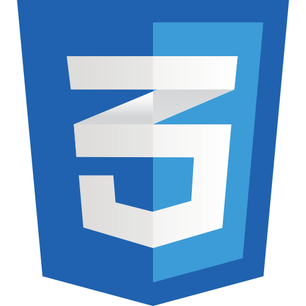
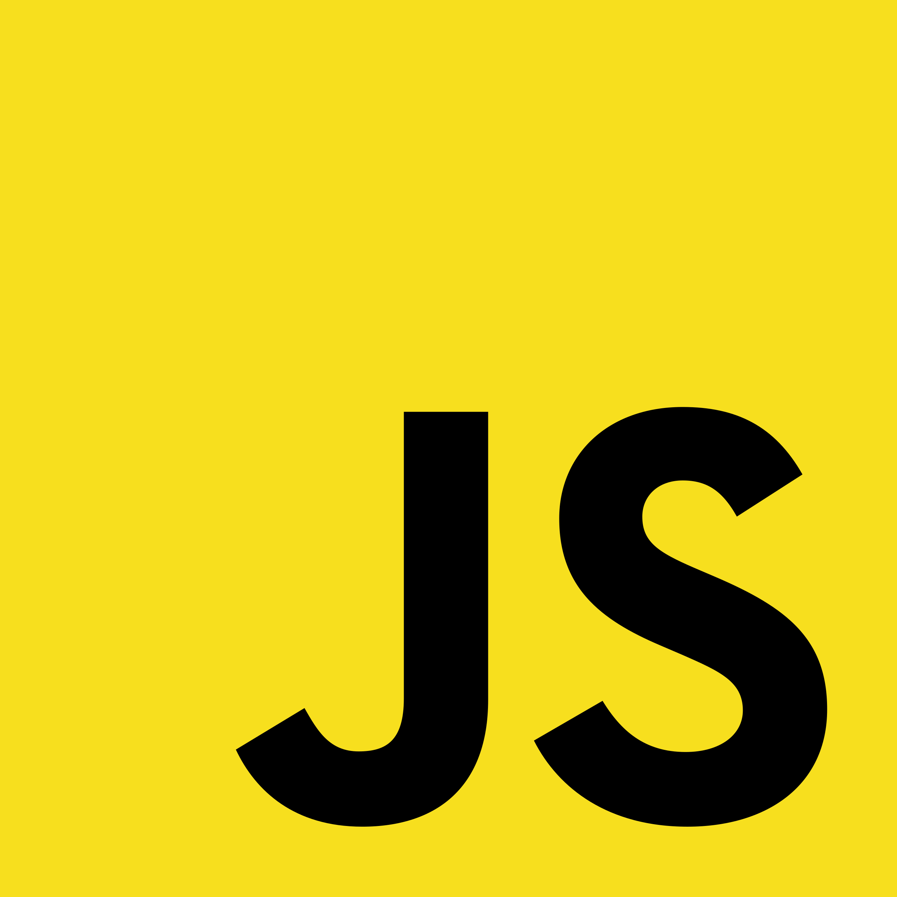
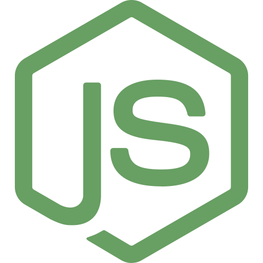
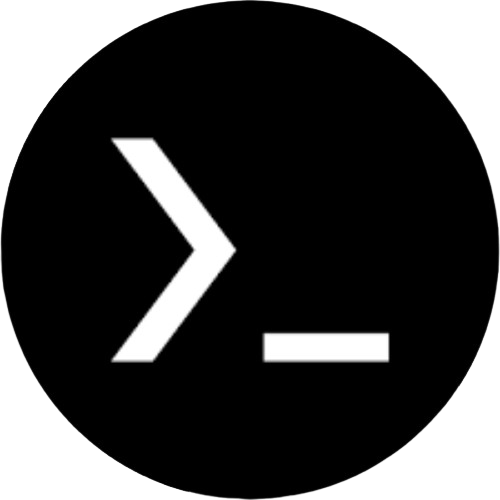

# [Nadson de Jesus Almeida](https://nadsondejesusalmeida.github.io)

Este repositório contém o meu **site pessoal**. Criado e desenvolvido para mostrar minhas informações profissonais.

## ℹ️ Informações

	
	
	
	

## Linguagens &amp; Frameworks

	
	
	
	

## Ferramentas que eu utilizo diariamente

	
	
	
	
	
	

## Outros repositórios
- [Projeto Android](https://github.com/nadsondejesusalmeida/projeto-android)
- [Projeto Cordel](https://github.com/nadsondejesusalmeida/projeto-cordel)
- [Projeto Login](https://github.com/nadsondejesusalmeida/projeto-login)
- [Projeto RGBA](https://github.com/nadsondejesusalmeida/projeto-rgba)
- [Projeto Calendário](https://github.com/nadsondejesusalmeida/projeto-calendario)
- [Projeto Audiobook](https://github.com/nadsondejesusalmeida/projeto-audiobook)
- [Projeto Apple Watch](https://github.com/nadsondejesusalmeida/projeto-apple-watch)
- [Projeto Cardápio Digital](https://github.com/nadsondejesusalmeida/projeto-cardapio-digital)
- [Lista de Tarefas](https://github.com/nadsondejesusalmeida/lista-de-tarefas)